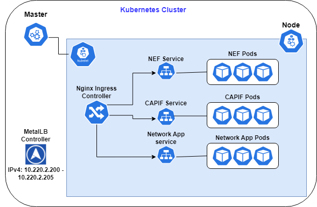

# Network Apps Integration and Deployment

This repository contains the necessary information and instructions (manifest files) for integrating and deploying Network Apps within the Athens K8s Cluster. The integration activities aim to validate the Network Applications, showcasing their validation when integrated with the vApp.

## Goals of Deployment Activities

The deployment activities focus on achieving the following goals:

1. Integration of 5G Connectivity: Validate the real 5G connectivity for each specific use case (whether it is applicable)
2. Ensure Effective Communication: Establish communication channels between the vApp, Network Application, NEF, CAPIF, and TSN.

## Versioning

| Component | Version   |
|-----------|-----------|
| CAPIF     | v3.1.2    |
| NEF       | v2.2.2    |
| SDK       | v1.0.7    |
| TSN       | v1.2.1    |

## Kubernetes Cluster

- `nginx-manifests`: Includes the manifest to set up the Nginx Ingress Controller. Through ingress rules (hostnames), it forwards incoming requests to the K8s services and subsequently to the respective pods where the containers reside.
- `MetalLB`: Provides the required resources for MetalLB, which assigns an external IP address to the Nginx Ingress Controller. This enables accessibility within the NCSRD infrastructure. (through VPN)

### Topology 



# Guidelines for the SMEs - Manifest Files Creation

## Step 1: Push Docker Images to a Public Docker Registry

To begin, push the latest Docker images that make up your Network Application to a public Docker registry. The recommended approach is to use Docker Hub repository. You can access Docker Hub at [https://hub.docker.com/](https://hub.docker.com/).

Follow these steps to push your Docker images:

1. Tag the Docker image using the following command:
   ```
   docker tag <image-id> <your-dockerhub-username>/nef-emulator-backend:v1
   ```
   Replace `<image-id>` with the ID of your Docker image and `<your-dockerhub-username>` with your Docker Hub username.

2. Log in to Docker Hub using the `docker login` command.

3. Push the tagged Docker image to Docker Hub:
   ```
   docker push <your-dockerhub-username>/nef-emulator-backend:v1
   ```
   Ensure to replace `<your-dockerhub-username>` with your Docker Hub username.

## Step 2: Create Manifest .yaml Files for Kubernetes Deployment

Next, create the manifest .yaml files required for deploying your Network Application in Kubernetes. You need the following files:

- **Deployment Resource File**: This file defines the deployment configuration for your Network Application.

- **Service Resource File**: This file specifies the service configuration to expose your Network Application within the Kubernetes cluster.

- **ConfigMap Resource File** (Optional): If your pods consume config maps as environmental variables, you can create a separate file to define the configmap resource.


Refer to the Kubernetes documentation and customize the manifest files according to your Network Application's requirements.

# Guidelines for the SMEs - Ingress Rules


## Step 1: Update Hostnames in Network App's Code

To ensure seamless integration with NEF and CAPIF reverse proxies, update the hostnames in your Network Application's code. The optimal way to handle this is through environment variables. 

- NEF: Access NEF using the hostname `nefemu`.
- CAPIF: Access CAPIF using the hostname `capifcore`.

## Step 2: Update Callback URL

Next, update the callback URL for your Network Application to match the service name created in the manifest `service.yaml` file.

# Guidelines for the SMEs - Monitoring

This repository provides guidelines for SMEs (Subject Matter Experts) on monitoring NEF (Network Exposure Function) and CAPIF (Common API Framework) services. The monitoring is performed through specific URLs.

> Monitoring NEF's UI

To monitor NEF's UI, access the following URL: [https://validation-athens.com](https://validation-athens.com). 

> Monitoring CAPIF's Database

For monitoring CAPIF's database, use the URL [https://mongocapif.com](https://mongocapif.com).

> Monitoring NEF's Database

To monitor NEF's database, use the URL [https://mongonef.com](https://mongonef.com). 

## Prerequisites for Monitoring the Services

1. VPN Access: You need VPN access to establish a connection to the NCSRD premises.

2. Map Hostnames to `/etc/hosts` File: Map the provided hostnames to the `/etc/hosts` file on your local machine. This step informs your local machine about the external IP `10.220.2.201`. Note that the external IP may change!

## Exposing Network App's Service

If you want to expose your Network Application's service, you need to create a new ingress rule.


